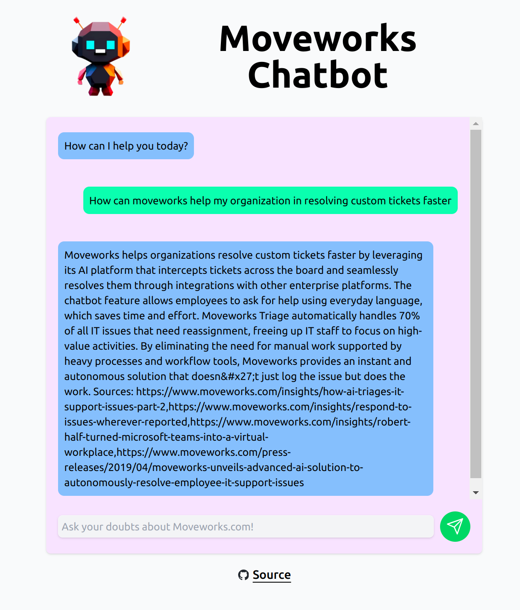
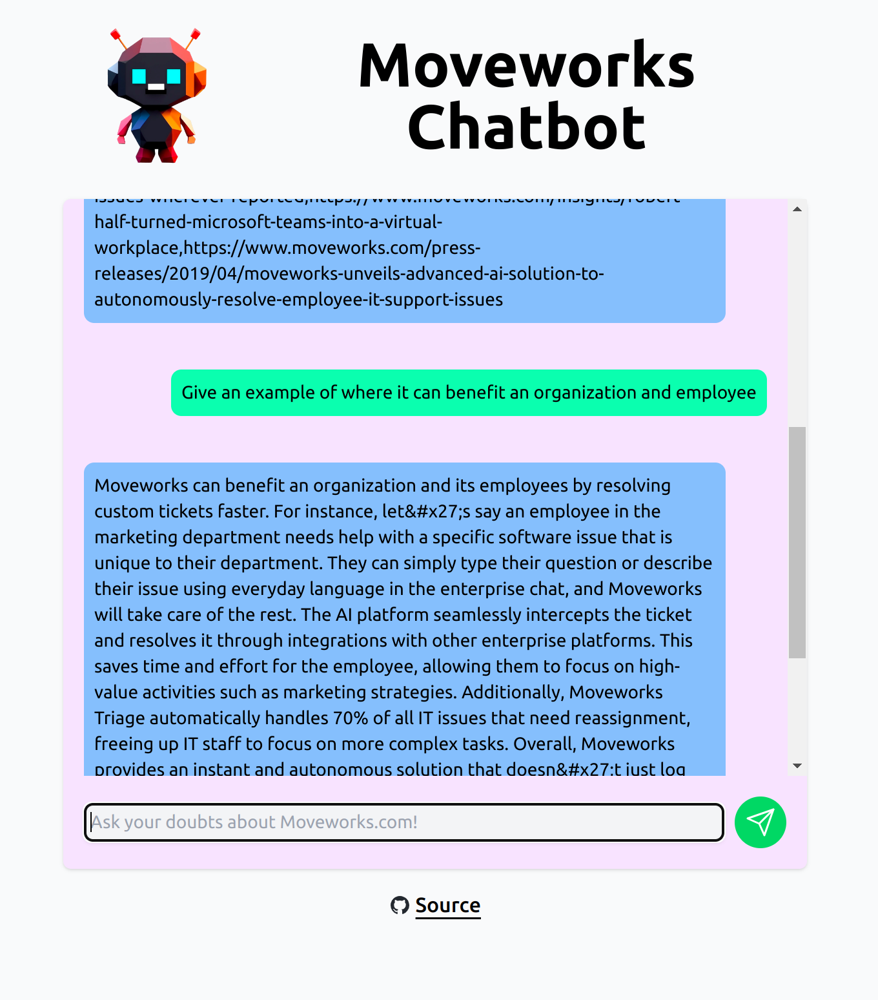
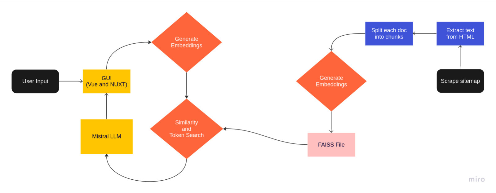

# MoveWiser - An AI powered chatbot for your website

## Tech Stack

**Frontend**:
- Vue & Nuxt

**Backend**:
- Flask
- FAISS vector DB storage
- custom script to scrape URLs on a website

## Details

1. Scraping

The first task is to scrap all data available on a website. We took an approach of looking at `sitemap.xml` and downloading all pages followed by cleaning up and storing the images.

2. Generating Embeddings

We are using `all-mpnet-base-v2` to generate embeddings and storing it in FAISS Vector storage database.

3. Flask Backend

When a query comes we use it to generate vector embedding and keyword based search and figure out the relevant parts.

4. LLM

We use [Mistral AI's](https://mistral.ai/news/announcing-mistral-7b/) latest LLM that came just a few days back. We tried 13B-Llama2, but this was faster on our machine.

We used this [repository](https://github.com/oobabooga/text-generation-webui) to easily run, look at performance and create an API for the model.

5. Frontend

We did not have too much time for making it look good, and adding the features that we wanted to, but it is a functioning reponsive chatbot app.

## Some interesting features

- Everything runs locally (from generating embeddings, to storing, and also running LLM)
- We have performed OCR on images and added also added it into generating embeddings.
- Alongside using similarity search, we wrote a simple token based keyword search to answer direct questions, which otherwise could be missed.

## Team: Ctrl+Alt+Defeat

- Divyansh Singh
- Param Gandhi
- Ritwik Sharma
- Vimarsh Shah
